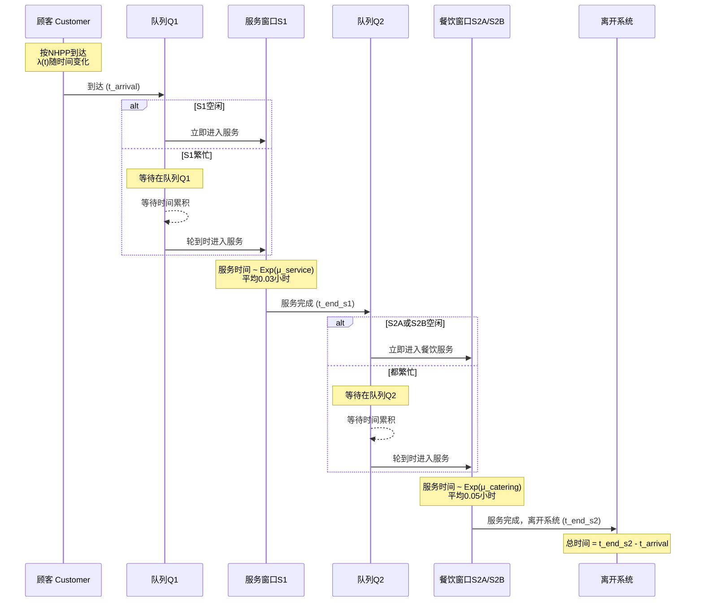
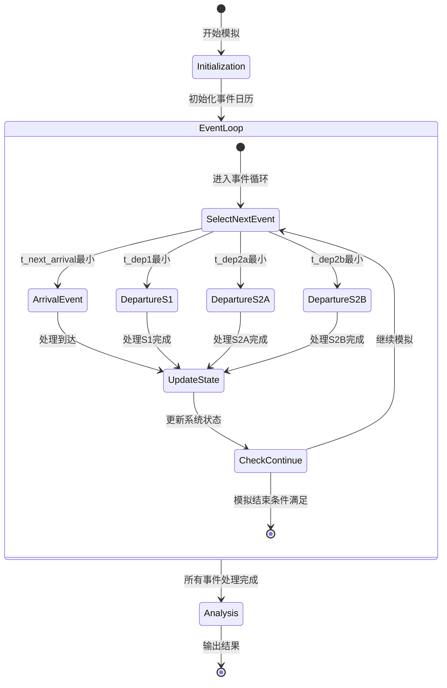

# McDonald's Queuing System Simulation - Flow Diagram

## System Flow Diagram (UML Activity Diagram)

```mermaid
flowchart TD
    Start([开始模拟]) --> Init[初始化系统<br/>- 设置参数<br/>- 生成NHPP到达时间表<br/>- 初始化事件日历]
    
    Init --> MainLoop{主循环条件<br/>还有顾客到达或<br/>系统中有顾客?}
    
    MainLoop -->|否| End([模拟结束])
    MainLoop -->|是| FindNext[找出下一个事件<br/>min(到达, 离开S1, 离开S2A, 离开S2B)]
    
    FindNext --> EventType{事件类型?}
    
    %% 顾客到达事件
    EventType -->|顾客到达| CheckS1{服务窗口S1<br/>空闲?}
    CheckS1 -->|是| StartS1[顾客进入S1服务<br/>记录开始时间<br/>安排S1离开事件]
    CheckS1 -->|否| JoinQ1[顾客加入队列Q1]
    
    StartS1 --> ScheduleNext[安排下一个顾客到达]
    JoinQ1 --> ScheduleNext
    ScheduleNext --> MainLoop
    
    %% S1完成事件
    EventType -->|S1服务完成| RecordS1[记录S1结束时间]
    RecordS1 --> CheckS2{餐饮窗口<br/>S2A或S2B空闲?}
    
    CheckS2 -->|S2A空闲| StartS2A[顾客进入S2A<br/>记录开始时间<br/>安排S2A离开事件]
    CheckS2 -->|S2B空闲| StartS2B[顾客进入S2B<br/>记录开始时间<br/>安排S2B离开事件]
    CheckS2 -->|都忙| JoinQ2[顾客加入队列Q2]
    
    StartS2A --> CheckQ1
    StartS2B --> CheckQ1
    JoinQ2 --> CheckQ1
    
    CheckQ1{队列Q1<br/>有顾客?}
    CheckQ1 -->|是| DequeueQ1[从Q1取出顾客<br/>进入S1服务<br/>安排S1离开事件]
    CheckQ1 -->|否| IdleS1[S1设为空闲]
    
    DequeueQ1 --> MainLoop
    IdleS1 --> MainLoop
    
    %% S2A完成事件
    EventType -->|S2A服务完成| RecordS2A[记录S2A结束时间<br/>顾客离开系统]
    RecordS2A --> CheckQ2A{队列Q2<br/>有顾客?}
    
    CheckQ2A -->|是| DequeueQ2A[从Q2取出顾客<br/>进入S2A服务<br/>安排S2A离开事件]
    CheckQ2A -->|否| IdleS2A[S2A设为空闲]
    
    DequeueQ2A --> MainLoop
    IdleS2A --> MainLoop
    
    %% S2B完成事件
    EventType -->|S2B服务完成| RecordS2B[记录S2B结束时间<br/>顾客离开系统]
    RecordS2B --> CheckQ2B{队列Q2<br/>有顾客?}
    
    CheckQ2B -->|是| DequeueQ2B[从Q2取出顾客<br/>进入S2B服务<br/>安排S2B离开事件]
    CheckQ2B -->|否| IdleS2B[S2B设为空闲]
    
    DequeueQ2B --> MainLoop
    IdleS2B --> MainLoop
    
    End --> Analysis[计算性能指标<br/>- 平均等待时间<br/>- 系统逗留时间<br/>- 加班时间]
    Analysis --> Visualize[生成可视化图表]
    Visualize --> Complete([完成])
    
    style Start fill:#90EE90
    style End fill:#FFB6C1
    style Complete fill:#90EE90
    style MainLoop fill:#FFE4B5
    style EventType fill:#FFE4B5
    style CheckS1 fill:#E6E6FA
    style CheckS2 fill:#E6E6FA
    style CheckQ1 fill:#E6E6FA
    style CheckQ2A fill:#E6E6FA
    style CheckQ2B fill:#E6E6FA
```

## System Architecture Diagram

```mermaid
graph LR
    subgraph "输入 Input"
        A1[NHPP到达过程<br/>λ(t) = 基础率 + 午餐峰 + 晚餐峰]
        A2[服务参数<br/>μ_service = 33.33/h<br/>μ_catering = 20/h]
    end
    
    subgraph "排队系统 Queuing System"
        Q1[队列Q1<br/>List-based Queue]
        S1[服务窗口S1<br/>M/M/1]
        Q2[队列Q2<br/>List-based Queue]
        S2A[餐饮窗口S2A<br/>M/M/2]
        S2B[餐饮窗口S2B]
    end
    
    subgraph "输出 Output"
        R1[性能指标<br/>- 等待时间<br/>- 系统时间<br/>- 加班时间]
        R2[可视化<br/>- 到达分布<br/>- 等待时间分布<br/>- 时间序列分析]
    end
    
    A1 --> Q1
    A2 --> S1
    A2 --> S2A
    A2 --> S2B
    
    Q1 --> S1
    S1 --> Q2
    Q2 --> S2A
    Q2 --> S2B
    
    S2A --> R1
    S2B --> R1
    R1 --> R2
    
    style Q1 fill:#FFE4E1
    style Q2 fill:#FFE4E1
    style S1 fill:#ADD8E6
    style S2A fill:#98FB98
    style S2B fill:#98FB98
```

## Customer Journey Sequence Diagram



## Event Calendar State Machine



## Key Components

### 1. **Non-Homogeneous Poisson Process (NHPP)**

- 使用Thinning Algorithm生成到达时间
- λ(t) = 基础率 + 午餐高峰 + 晚餐高峰
- 最大率 λ_max = 60 customers/hour

### 2. **Queue Data Structure (优化版)**

- 使用List-based实现，避免向量复制
- O(1)时间复杂度的入队和出队操作
- 字符串索引避免R的list索引问题

### 3. **Event-Driven Simulation**

- 事件类型：到达、S1完成、S2A完成、S2B完成
- 事件日历追踪下一个事件时间
- 按时间顺序处理事件

### 4. **Performance Metrics**

- 排队等待时间（订餐、取餐）
- 系统总时间
- 服务器利用率
- 加班时间分析
